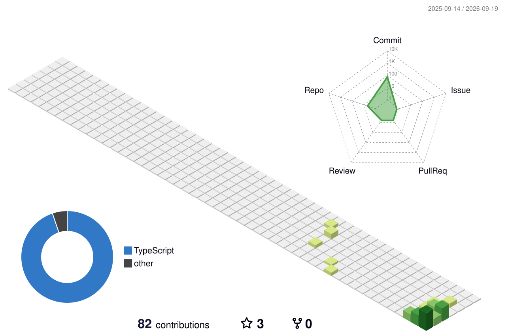

  

  

  
  
  

<table>
  <tr>
    <td width="55%" valign="top">
      <h3>💫 About Me</h3>
      
I am a passionate software developer dedicated to building impactful, high-performance web experiences. I love bridging the gap between design and technology, turning ideas into polished, production-ready products.

      <ul>
        <li>🔭 I’m currently working on enhancing web projects and mastering advanced architectures.</li>
        <li>📚 Always exploring new frameworks, design paradigms, and optimization techniques.</li>
        <li>💬 Ask me about <b>React, TypeScript, Next.js</b>, or anything web dev!</li>
        <li>📫 Reach out to me: <b>maniprasad76@gmail.com</b></li>
      </ul>
    </td>
    <td width="45%" valign="top" align="center">
      <h3>🏆 Achievements</h3>
      
    </td>
  </tr>
</table>

<h3 align="center">🛠️ Tech Stack & Skills</h3>

  

<h3 align="center">⭐ Featured Project</h3>

  

<h3 align="center">📊 My GitHub Metrics</h3>

  <table border="0">
    <tr>
      <td align="center" valign="top">
        
      </td>
      <td align="center" valign="top">
        
      </td>
    </tr>
  </table>

  

  

<h3 align="center">🎨 Contribution Visualizations</h3>

<table border="0" align="center">
  <tr>
    <td align="center" valign="top" width="50%">
      <h4>👾 Contribution Snake</h4>
      <picture>
        <source media="(prefers-color-scheme: dark)" srcset="https://raw.githubusercontent.com/maniprasad76/maniprasad76/output/github-contribution-grid-snake-dark.svg">
        <source media="(prefers-color-scheme: light)" srcset="https://raw.githubusercontent.com/maniprasad76/maniprasad76/output/github-contribution-grid-snake.svg">
        
      </picture>
    </td>
    <td align="center" valign="top" width="50%">
      <h4>📐 3D Calendar</h4>
      
    </td>
  </tr>
</table>

 
